# PLEASE HOLD

**A first-person narrative horror game set in the overnight dispatch office of a
rural electric utility, November 1999.**

You are the only person in the District Operations Center of Wright County Power
& Light. There is a storm across the district, three trucks for a whole county,
and a telephone that has been on that desk since 1961.

Take the call. Get the address. Confirm it against the account, not against the
caller. Open a ticket. Send a unit that is rated for the work.

Do not promise a restore time.

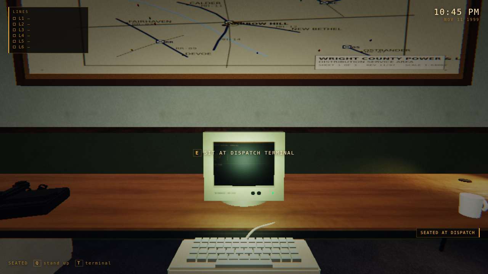

---

## The setting is 1999. The renderer is not.

This is deliberate and it is the project's main visual rule. The world is a
1962 municipal building refurbished in 1978 and full of 1999 office equipment,
rendered with modern lighting, shadows, reflections and post-processing. There
is no vertex wobble, no affine texture warping, no fake pixelation. See
`AGENTS.md` for the full standard.

Every surface material is procedurally generated at boot — commercial loop-pile
carpet, mineral fiber ceiling tile, orange-peel drywall, waxed VCT, oak
laminate — so the game ships with no texture pack and every material can be
replaced with real art one file at a time.

---

## Engine

No engine. No build step. No framework.

* **Vanilla JavaScript**, ES modules, served as static files
* **[three.js](https://threejs.org) r169** (WebGL2), vendored at `src/vendor/three.module.js`
* Custom post-processing chain (bloom, ACES tonemap, grade, grain, vignette,
  chromatic aberration) written for this project — `src/engine/postfx.js`
* All audio synthesized at runtime with **WebAudio** — no sound files
* **Electron** for desktop builds
* **playwright-core** for the headless test harnesses

Requires a browser with WebGL2. Node 18+ only to run the static server and the
tests.

---

## Running it

```bash
npm start            # serves on http://localhost:8080
```

Then open <http://localhost:8080>.

It must be served over `http://` — browsers refuse to load ES modules from
`file://`.

### As a desktop app

```bash
npm install          # pulls electron + electron-builder (dev only)
npm run app          # run it
npm run dist         # package for the current platform
```

### Performance

The game targets 60fps and **adapts to hold it**: the renderer watches a rolling
median frame time and walks the internal resolution down when the budget is
missed, back up when there is headroom. Three presets sit on top of that
(`Options > QUALITY`), controlling the number of real-time lights, MSAA, shadows,
rain density and shader detail.

Two defaults worth knowing about:

* **Resolution defaults to 1x even on a Retina display.** A 2x display renders
  four times the fragments for a difference that is close to invisible in a
  dark, grainy, post-processed picture. Turn it up in Options if you have the
  headroom.
* **The ceiling lighting is baked.** All thirteen fixtures are evaluated once at
  load into per-vertex irradiance, so the room is fully lit with only a handful
  of real-time lights. See `AGENTS.md` §2 for why this matters.

Press **F3** in game for live frame time, draw calls and light count.

### Tests

```bash
npm run check           # every harness below except perf and shots
node tools/calls.mjs    # validate every call script (no browser needed)
npm run check:render    # render the audio to ./audio/*.wav and measure it
npm run check:audio     # live bus levels, balance and voice-chain leaks
npm run check:tutorial  # play the handover call gate by gate
npm run check:controls  # key routing, pointer lock, the pause-menu loop
npm run check:pad       # the whole job with pad buttons and no keyboard
node tools/perf.mjs     # lights, draw calls and render target per preset
npm run shots           # capture screenshots to ./shots
```

`check:render` is the one worth knowing about: it runs the whole audio engine
in an `OfflineAudioContext`, writes real WAVs to `./audio`, and measures them.
**Listen to those files.** A spectrum cannot tell rain from static — both can
be shaped identically — so what it actually checks is the envelope: how much
the level wanders, how far peaks stand above the bed, and how many discrete
impacts there are per second.

---

## Controls

Every binding lives in one table, `src/engine/controls.js`. A gamepad button is
folded into the same key set the rest of the game already reads, so nothing
outside that file and `src/engine/input.js` knows a controller exists — and
every key hint on screen prints itself in whatever the player is holding.

### Moving
| Keyboard | Pad | |
|---|---|---|
| `W A S D` | left stick | walk |
| mouse | right stick | look |
| `Shift` | `LT` / `L2` | move quickly |
| `E` | `A` / `✕` | use what you are looking at |
| `Q` | `L3` | stand up from the desk (or use the chair again) |
| `Esc` | `Menu` / `Options` | pause |
| `F3` | — | frame time, draw calls, light count (outside the terminal) |

Click the window to look around: the browser only grants the mouse after a
click, and the HUD says **CLICK TO LOOK AROUND** until it has one. Losing the
pointer never pauses the game — that is what used to put the pause menu into a
loop. A pad does not need the pointer at all.

### The telephone
| Keyboard | Pad | |
|---|---|---|
| `F` | `Y` / `△` | answer the ringing line, or return to the caller |
| arrows + `Return` | d-pad + `A` / `✕` | choose a reply and say it |
| `1` – `4` | — | reply directly (outside the terminal) |
| `H` | `X` / `□` | put the caller on hold / return to a held caller |
| `X` | `RT` / `R2` | hang up |

Hanging up is on a trigger rather than a face button on purpose: it is the one
action you must not press by accident.

A caller on hold is still there and still counting. Some will wait a long time.
Some will not, and they will remember.

### The terminal
| Keyboard | Pad | |
|---|---|---|
| `T` | `View` / `Share` | sit down at the terminal / step back from it |
| `1` – `5` | `LB` / `RB` (`L1` / `R1`) | call, tickets, accounts, map, log |
| arrows | d-pad | move the selection |
| `Return` | `A` / `✕` | pull a record, open a ticket, send a unit |
| `N` | `LT` / `L2` | open a trouble ticket for whoever is on the line |
| `Esc` | `B` / `○` | back one step |
| mouse | — | click the tabs, click any row, press the on-screen keys |

Five screens, and the two you live on are `1` and `2`.

**`1` CALL** is the terminal's answer to the question you always have: who is
this. The number comes up with the call and the account comes up with the
number — you never type a name to serve the person on the line. `Return` pulls
the record (the notes, the meter, the medical alerts), `N` opens a ticket
already filled in from it.

**`2` TICKETS** carries dispatch inside it. `Return` on a ticket drops the
units underneath it with an ETA and a reason each one is or is not suitable;
`Return` on a unit sends it. A ticket you have just written lands open with
the recommended unit already under the cursor — which is a default, not a
decision: the unit that is closest is regularly the unit that is not rated for
the work, and the game will let you send them.

**`3` ACCOUNTS** is the search, for when you need somebody who is not on the
line: the neighbour, the address that does not match what you are being told.
Type into it, or press `Return` on the search box for on-screen keys.

### Playing on a controller, with no keyboard at all

Everything is reachable with a pad — including the parts that used to be
letter keys. The search box opens an on-screen keyboard; the hazard flag on a
new ticket is a row you select rather than an `H` you have to know about; a new
ticket is a row at the top of the list as well as a trigger; and the options
panel is navigable with the d-pad instead of only being clickable.

`npm run check:pad` plays a whole call — answer, read the account, spell a
name on the on-screen keys, write a ticket, set the hazard flag, dispatch a
unit — pressing pad buttons and nothing else. If a screen ever grows a letter
key again, that harness is what catches it.

The screens are on the number row, not `F1` – `F6`: most laptops put the
function row behind an `Fn` chord, which made the terminal unusable without a
desktop keyboard. `F1` – `F6` still work for anyone who has them.

Using the computer is what sits you at it — you do not have to find the chair
first. The terminal takes over the screen and locks the camera while you are
in it.

### A call while you are in the terminal

A live call docks under the terminal instead of covering it, so you can read
the caller and work the screens at the same time. Two panels want the arrow
keys, so they take turns, and the panel that has them says so:

* a new reply takes the arrow keys, because somebody is waiting;
* touching a screen, a row or a tab hands them to the terminal;
* `F` (`Y` / `△`) fetches them back to the caller.

The replies stay on screen and stay clickable the whole time. Inside the
account search, letters are letters — `F`, `H` and `X` type rather than work
the phone, because a name with an F in it has to be typeable.

Several dialogue replies are only available once you have actually looked
something up. That is deliberate: you cannot confirm a service address you have
not read.

---

## What is implemented

**Systems**

| | |
|---|---|
| First-person movement | acceleration, collision, head bob, footsteps, a real seated mode at the desk |
| Interaction | center-screen raycast, per-object range, seated-only objects |
| Telephone | six line appearances, ring cadence, hook, **hold with per-caller patience**, hold music, auto-park when you pick up a second line |
| Calls | fully data-driven scripts (`src/data/calls/`), validated at boot and in CI |
| Dialogue | node graph, requirement-gated player replies, declarative effects |
| Caller memory | per-caller trust, what they told you, what you promised, hold time, hang-ups |
| Customer database | 13 accounts, search by account/name/phone/address/circuit, lookup tracking, and deliberate corruption |
| Outages | trouble tickets, causes, hazards, priority, meter counts, history |
| Service-area map | one territory definition drives the wall map *and* the CRT map |
| Dispatch | crew recommendations with ETA, skill rating and a stated reason |
| Field crews | 3 units that drive, arrive, work, and clear over the radio in real shift time |
| Radio | queued traffic, squelch, per-crew voices, interference |
| Story scheduler | beat calls, time calls, a weighted random pool, and a rhythm rule that keeps ordinary work between the strange calls |
| Horror | 13 named events from "the storm could be doing this" to events with no innocent reading |
| Environment | procedural office, storm exterior, rain volume, rain-on-glass shader, lightning, fluorescent ballast simulation |
| Audio | full synthesis, no files: rain built from brown noise, a wandering sheet and ~30-70 discrete impacts a second; thunder, ballast hum, CRT flyback, ring, dial tone, DTMF, squelch, hold music, and **five telephone line treatments** |
| Voices | a source-filter synthesizer driven by the words themselves: spelling to phonemes, three formants that **slide** between targets, turbulence for the fricatives, real closures and bursts for the stops, and a phrase contour with stress and question rises |
| Rendering budget | baked static lighting, a pooled light rig, static geometry merging, three quality presets and an adaptive resolution scaler |
| Game clock | shift time, and events that can lie about it |
| Save | checkpoint at every story beat |
| UI | title, options, how-to, pause, HUD, call panel, a full-takeover CRT terminal that scales with the window, end-of-shift report |
| Tutorial | `waitFor` dialogue nodes that hold a conversation until the player performs a real action, with an on-screen objective that names the keys the player actually has |
| Input | one binding table, keyboard and gamepad (Xbox / PlayStation button art chosen from the pad's own id), with every key hint on screen printed in whatever is plugged in |

**The shift** — 14 call scripts, 238 nodes, 420 lines, 169 player replies:

* **a handover call that teaches the desk by waiting for you to use it.** The
  night supervisor rings from home on your first solo shift and walks you
  through sitting down, the terminal, an account lookup, a ticket, a crew, and
  the hold button — each step held open until you have actually done it.
  Nothing in it is strange, which is the point
* four ordinary utility calls that give the night its texture
* **Mrs. Daley**, who calls twice and remembers what you did the first time
* a hazard call that forces a real trade-off against a finite number of trucks
* a crew sequence over the radio that finds something that should not be there
* a suspicious address that still has an innocent explanation
* an EVP call built on a real audio chain, not on the words `[STATIC]`
* a caller who says the year out loud, with corroborating evidence
* the dispatcher who worked this desk in 1978

---

## What it looks like

| | |
|---|---|
| 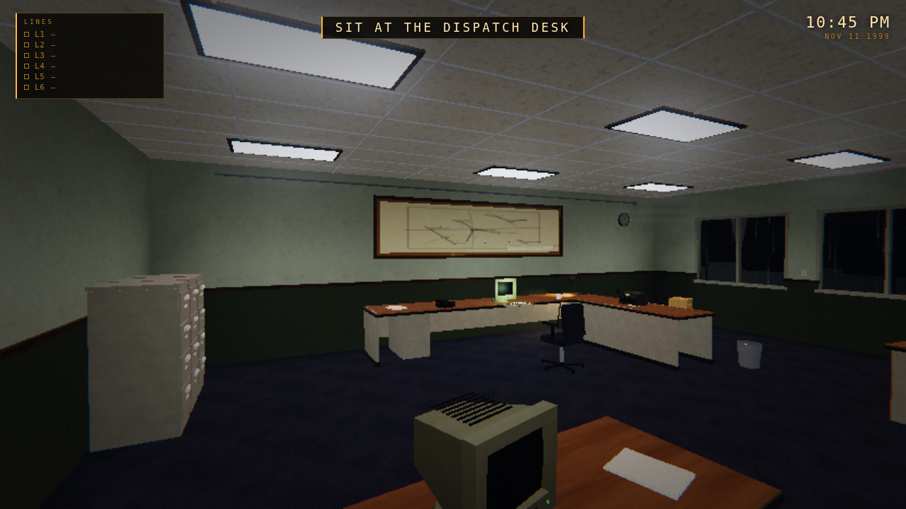 | 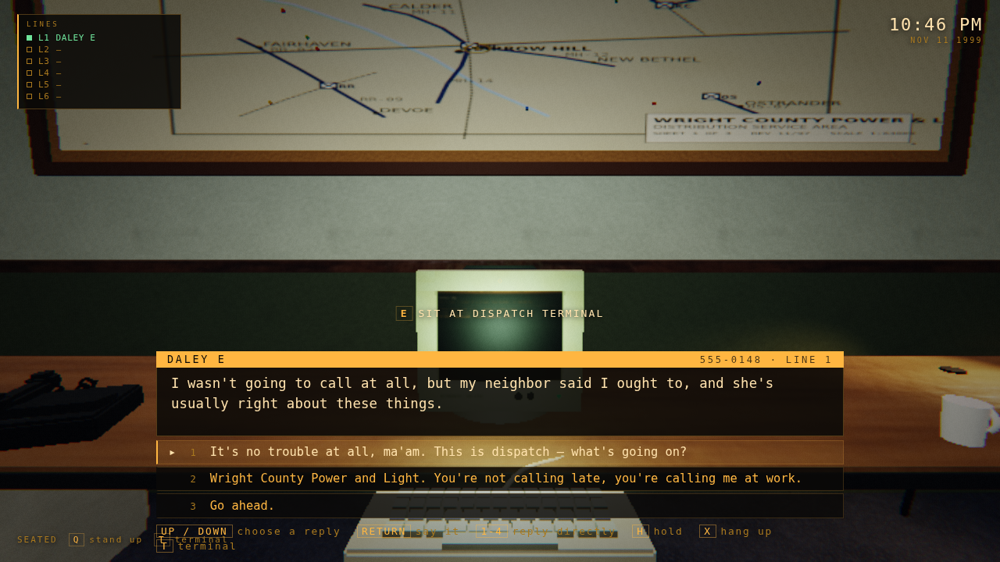 |
| the dispatch room at 22:45 | a caller, and four ways to answer |
| 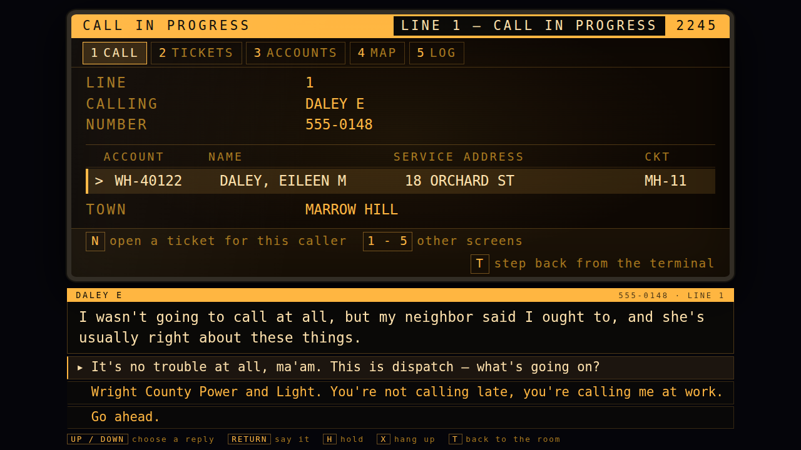 | 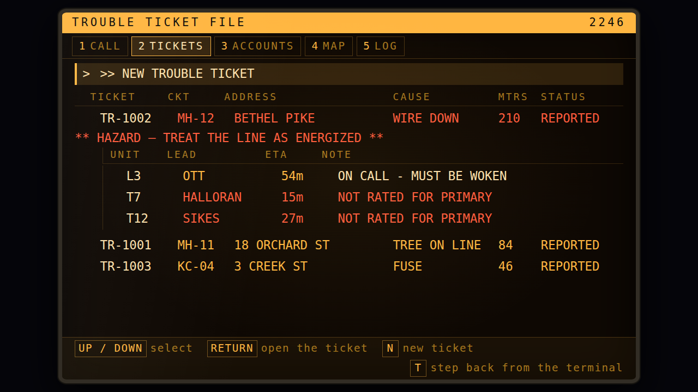 |
| the terminal: who is on the line, and their account, without typing a thing | the terminal: a ticket, with the units folded in underneath it |
| 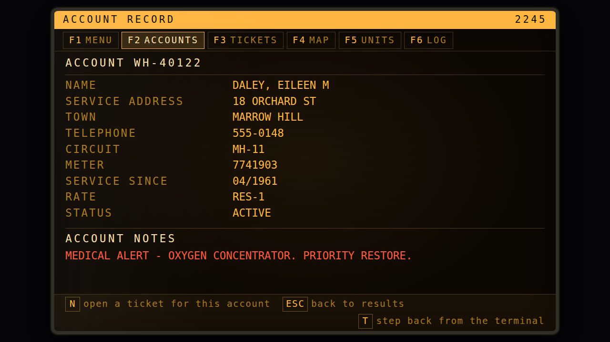 | 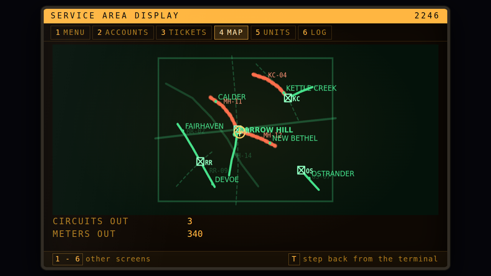 |
| the terminal: a record, with a medical alert | the terminal: circuits with trouble |
| 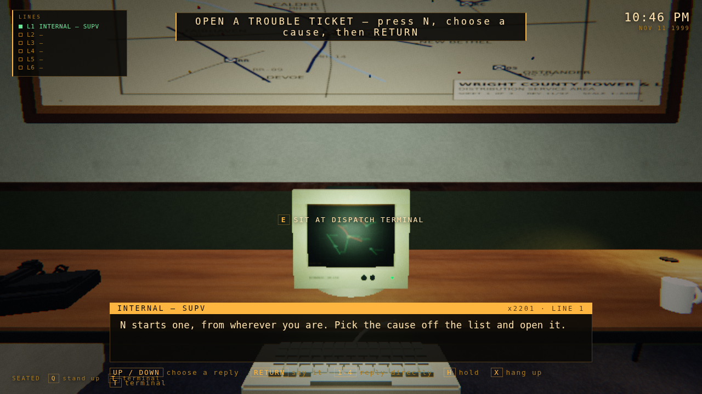 | 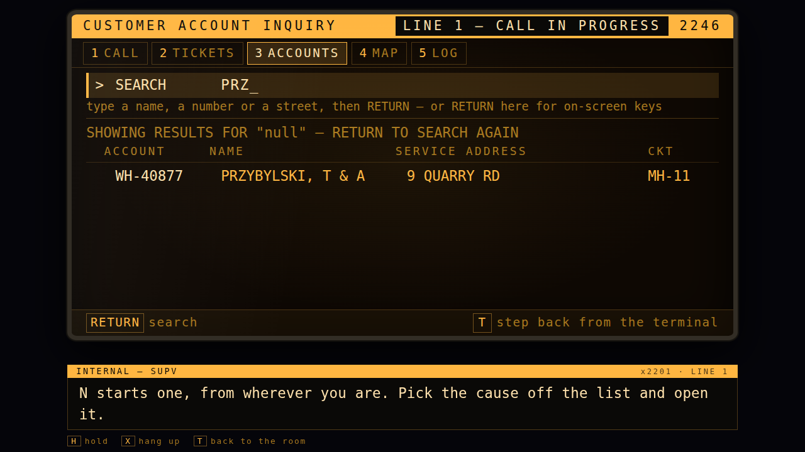 |
| the handover call, waiting for you to do the thing | a live call docked under the terminal while you work |
| 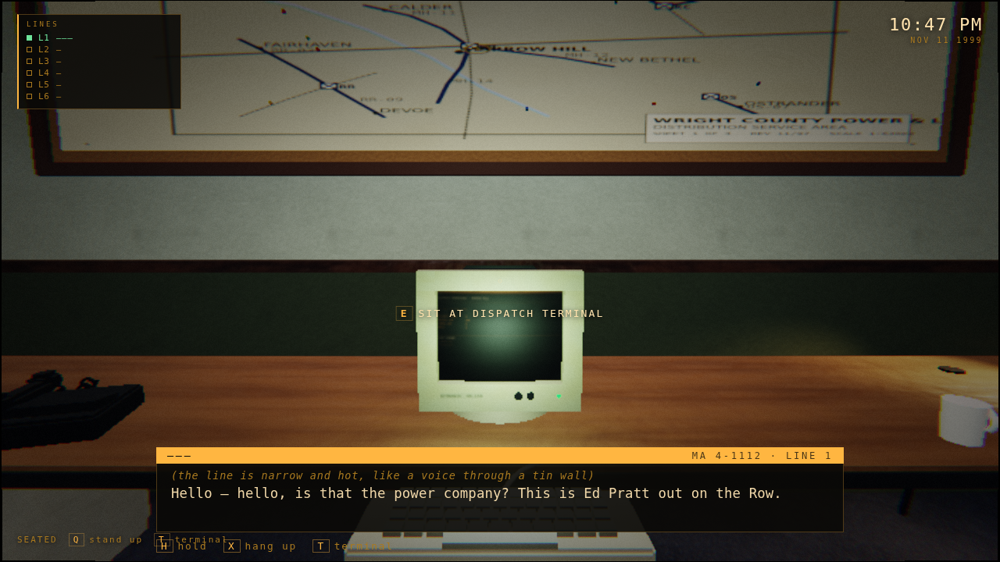 | 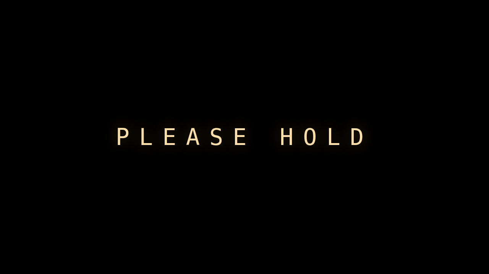 |
| a caller whose line does not sound like 1999 | the end of the slice |

---

## Repository layout

```
index.html            the shell: canvas + UI layers
serve.cjs             zero-dependency static server
src/
  main.js             boot
  style.css           the interface
  vendor/             three.js r169 (vendored, unmodified)
  engine/             renderer, postfx, materials, textures, noise, audio,
                      phonemes (spelling -> speech), input,
                      controls (every binding), quality, bus
  world/              plan, office builder, props, workstation, signage, lighting, weather, dress
  game/               clock, state, settings, save, player, interaction,
                      phone, dialogue, effects, calls, database, outages,
                      crews, dispatch, radio, horror, game
  ui/                 hud, callui, terminal (state), terminalview (DOM), menu
  data/
    calls/            ONE FILE PER CONVERSATION  <- add dialogue here
    accounts.js       the customer master file
    crews.js          the roster
    grid.js           the service territory
tools/                headless test + capture harnesses
electron/             desktop wrapper
```

## Where the assets live

There are no binary assets yet, by design. Everything is generated:

| What | Where | How to replace |
|---|---|---|
| Surface materials | `src/engine/textures.js` recipes | add a path to `IMAGE_OVERRIDES` in `src/engine/materials.js`, or call `MaterialLibrary.override()` |
| Maps, notices, labels, clock faces | `src/world/signage.js` | each function returns a `<canvas>`; return a loaded `` instead |
| Models | `src/world/props.js`, `workstation.js` | each prop is a function returning a `THREE.Group`; interaction logic is attached in `dress.js`, never baked into the mesh |
| Voices | synthesized in `src/engine/audio.js` | put a `clip:` id on any dialogue line and register the file with `audio.registerClip()` — line-by-line, no other change |
| Sound effects | `AudioEngine.play()` | same |

---

## Known limitations

See `ROADMAP.md`. The short version: this is a vertical slice. The shift does
not yet run to 06:00 — it ends on the 1978 call.

&copy; 2026 EM Software Innovators
